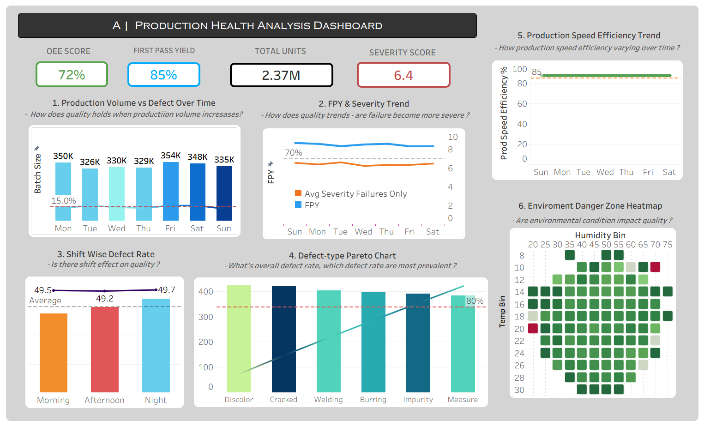
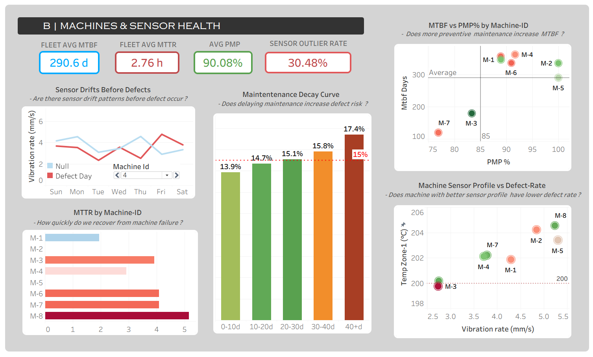
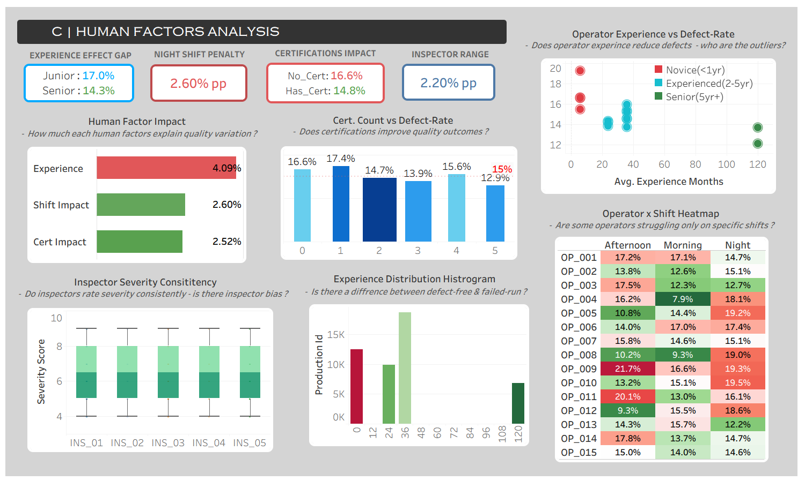

# 🏭 Manufacturing Product Yield & Quality Analysis

<div align="center">


**A manufacturing analytics project built on a synthetic multi-table dataset — from data design and SQL modeling to a 3-page Tableau dashboard.**

</div>

---

## 📌 Table of Contents

- [What is this project about](#-what-is-this-project-about)
- [Why I built this](#-why-i-built-this)
- [Dashboards](#-dashboards)
- [Dataset design](#-dataset-design)
- [Database structure](#-how-the-database-is-structured)
- [SQL pipeline](#-how-the-sql-pipeline-works)
- [Repository structure](#-repository-structure)
- [Key findings](#-key-findings)
- [What I learned](#-what-i-learned)
- [Tools used](#-tools-used)
- [Author](#-author)

---

## 🔍 What is this project about?

This project looks at one simple thing: **why does quality go down in a factory, and what is actually causing it?**

In real production work, the answer is usually not one thing. A run can go wrong because a machine is acting up, maintenance happened too late, the process is drifting, the people on the line are doing things differently, or the product itself is harder to make right.

I wanted to build a project that feels like that kind of real work. So I designed a synthetic manufacturing dataset from scratch, shaped it like a real factory system, cleaned it in PostgreSQL, and turned it into Tableau dashboards that answer practical business questions.

---

## 💡 Why I Built This

I wanted to build something that shows **how I think**, not just what tools I know.

In manufacturing, the real question is never only *"What is the number?"* The real question is:

- ❓ Why did it change?
- ❓ What caused it?
- ❓ Is it a machine issue, a process issue, or a people issue?
- ❓ What should the business do next?

That way of thinking shaped the whole project. I wanted the workflow to feel like real operational analysis — start with a business problem, structure the data properly, create useful KPIs, check the patterns carefully, and turn the result into something a manager can actually use.

---

## 📊 Dashboards

### Page 1 — Company Production Health



> This page gives the quick answer a plant manager usually wants: **is the plant doing well, and where is quality loss happening?**

It shows how much good output the plant is making, how often defects are showing up, and whether the process is staying steady or starting to slip. That makes it useful for someone who wants the big picture first, before going deeper.

The main question here is simple: **is the plant doing fine, or is the process slowly slipping?**

---

### Page 2 — Machine & Sensor Health



> This page asks whether **machine condition and maintenance timing** are affecting quality.

It looks at machine reliability, downtime, how long it has been since the last service, and sensor readings that start acting strange before bad output shows up. In plain words, it tries to **catch trouble early.**

This page is useful for maintenance teams, reliability teams, or anyone who wants to know whether the machine is warning us before something goes wrong.

---

### Page 3 — Human Factors



> This page asks whether **the people running the process** are changing the output.

It studies how long people have worked, whether they are trained, which shift they work, and whether inspectors are seeing the same thing in the same way. The idea is to check whether human differences are actually visible in the quality result.

This page is useful for quality teams and managers who want to understand whether the issue is coming from the machine, the process, or the people working on it.

---

## 🗄️ Dataset Design

The dataset is synthetic, but it was **not built randomly**. I designed it using manufacturing logic so it behaves like a real industrial system during analysis.

To make it feel realistic, I added the kind of mess analysts usually see in production data:

| Challenge | Description |
|---|---|
| 🔲 Missing values | Some sensor channels have gaps, like real telemetry |
| 🔁 Duplicate records | Caused by clock skew in logging systems |
| 📋 Semi-structured fields | JSON-style maintenance and defect fields |
| 🏷️ Noisy labels | Inspection labels with realistic inconsistency |
| ⚖️ Uneven quality target | Not every product has the same tolerance |
| 📡 Sensor drift | Strange patterns appearing before failures |
| 📈 Outliers | Values that stand out from the usual pattern |
| ⚙️ Variation across groups | Differences across machines, people, and shifts |

That means the data does **not** behave like a clean demo file. It behaves like a system that needs real analysis.

> 📄 Full generation logic: [`/dataset_generation_logic.pdf`](dataset_generation_logic.pdf)
>
> 📄 Table-level data overview: [`/data_overview.pdf`](data_overview.pdf)

---

## 🏗️ How the Database is Structured

The project uses **six linked tables**. Each one represents a different layer of the manufacturing system.

```
sensor_readings      →  High-frequency machine readings
production_log       →  Main operational table (one row = one run/batch)
quality_inspection   →  Final inspection results and defect records
maintenance_log      →  Preventive and corrective maintenance events
operators            →  People-related details (experience, training, certifications)
product_catalog      →  Product family, tolerance limits, and recommended speed
```

| Table | Role |
|---|---|
| `sensor_readings` | Studies strange patterns, warning signs, and process stability |
| `production_log` | Connects machine, person, product, shift, timing, and environment |
| `quality_inspection` | Holds pass/fail target, defect count, defect type, and severity score |
| `maintenance_log` | Answers whether maintenance is actually helping |
| `operators` | Supports the human side of the analysis |
| `product_catalog` | Explains why some products are naturally harder to make right |

---

## ⚙️ How the SQL Pipeline Works

I did not jump straight into Tableau. I first built the data layer in SQL so the dashboard would sit on a clean base.

---

### `01_create_tables.sql`
Creates all six tables with the right PostgreSQL data types. Sets up the structure first so everything else has a stable base.

---

### `02_create_foreign_keys.sql`
Connects the tables properly after the data is loaded. Keeps the production system linked across machines, people, products, maintenance, and quality.

---

### `03_data_cleaning_and_type_corrections.sql`
Handles the messy parts that would otherwise break the analysis:

- Removes duplicates
- Turns JSON-style fields into proper `JSONB`
- Fixes data types
- Creates defect and maintenance flags

In simple words, it turns semi-structured data into something Tableau can work with cleanly.

---

### `04_feature_engineering.sql`
Creates the features the analysis actually needs:

| Feature | Description |
|---|---|
| `duration_minutes` | How long each run took |
| `production_date` | Daily join point across tables |
| `days_since_maint` | How long the machine went without maintenance |
| `last_maint_type` | Whether the last service was preventive or corrective |
| `is_outlier` | Marks unusual sensor readings |

---

### `05_view_master_production.sql`
Builds the **main production-level view**. Brings the major tables together into one dashboard-ready structure and calculates:

- Throughput
- Production efficiency
- Speed deviation
- Plant pressure

This is the main source for the **Company Production Health** and **Human Factors** pages.

---

### `06_view_machine_reliability.sql`
Builds the **machine summary view**. Holds machine-level measures:

| Metric | Meaning |
|---|---|
| `MTBF` | Average time a machine runs before a serious breakdown |
| `MTTR` | Average time it takes to fix a machine after breakdown |
| `maintenance_compliance` | Whether maintenance is happening on schedule |
| `downtime_split` | Breakdown of planned vs. unplanned downtime |
| `machine_defect_rate` | Defect rate tied to each machine |

This view supports the **Machine & Sensor Health** page.

---

### `07_view_operator_summary.sql`
Builds the **people summary view**. Shows:

- Defect rate by person
- Failure severity
- Production volume
- Shift mix
- Operational patterns

This view supports the **Human Factors** analysis.

---

### `08_view_sensor_pre_defect.sql`
Builds the **sensor view** that compares sensor behavior on defect days and normal days. Helps show whether vibration or temperature starts rising before a failure — the **early-warning** part of the project.

---

## 📁 Repository Structure

```text
manufacturing-yield-analysis/
│
├── sql/
│   ├── 01_create_tables.sql
│   ├── 02_create_foreign_keys.sql
│   ├── 03_data_cleaning_and_type_corrections.sql
│   ├── 04_feature_engineering.sql
│   ├── 05_view_master_production.sql
│   ├── 06_view_machine_reliability.sql
│   ├── 07_view_operator_summary.sql
│   └── 08_view_sensor_pre_defect.sql
│
├── dashboard/
│   ├── 01_dashboard_company_production.png
│   ├── 02_dashboard_machine_sensor.png
│   └── 03_dashboard_human_factors.png
│
├── dataset_generation_logic.pdf
├── data_overview.pdf
└── README.md
```

---

## 📊 Tableau Public Dashboard

<div align="center">

[](https://public.tableau.com/views/Manfr_YA/Dashboard-A?:language=en-US&:sid=&:redirect=auth&:display_count=n&:origin=viz_share_link)

*Use the Tableau tabs to move between all three dashboards.*

</div>

---

## 🔑 Key Findings

> **Maintenance timing matters.**
> Machines with longer gaps since maintenance showed more defects and less stable production.

> **Preventive beats corrective.**
> Preventive maintenance was generally tied to lower downtime and better consistency.

> **Sensors warn before failures.**
> Sensor readings often started acting strange before defect-heavy production periods.

> **Operating conditions amplify risk.**
> Harsh conditions made failures more likely during faster runs.

> **Experience helps, but machines matter more.**
> Experience reduced severe defects, but machine condition still had a stronger overall effect.

---

## 📚 What I Learned

This project reminded me that analytics is not just about storing data or drawing charts. The real work is **turning messy operational data into something that helps people make decisions.**

> A transactional database stores data safely.
> An analytical system should answer questions clearly.
> **That difference matters a lot in manufacturing.**

It also showed me how much domain knowledge changes interpretation. Rising vibration is not just a number. In a factory, it can mean a machine is starting to wear out. That is the kind of insight I wanted this project to capture.

---

## 🛠️ Tools Used

| Tool | Purpose |
|---|---|
|  **PostgreSQL** | Data storage, cleaning, analytical SQL, and view creation |
|  **pgAdmin / DBeaver** | SQL development and database management |
|  **Tableau Desktop** | Dashboard design and visualization |
|  **Tableau Public** | Dashboard publishing and sharing |

> The workflow is **SQL-first** because many manufacturing BI setups work that way.

---

## 👤 Author

<div align="center">

### Adarsh Kumar Majhi

*Analyst focused on operational behavior, manufacturing quality, and SQL-driven business analysis.*

[](https://www.linkedin.com/in/adarshkmajhi/)

</div>

---

<div align="center">

*If you found this project useful or interesting, feel free to ⭐ star the repository.*

</div>
